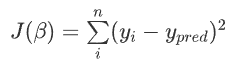
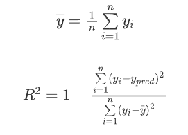

# 回归模型
## 1. 损失函数
### 1.1 OLS(ordinary least squares)
数学形式：
    
&emsp;&emsp;只有当模型满足六个OLS的必要假设的时候，这个损失函数才能达到很好的效果，接下来就是六个必要的假设
### 1.2 线性
&emsp;&emsp;只有直线是可以的，如果是非线性的，需要做特征转换。  
多项式回归很不错，值得推荐，多项式回归有点像泰勒展开式。
$R^2$反映了模型的预测能力：
  

